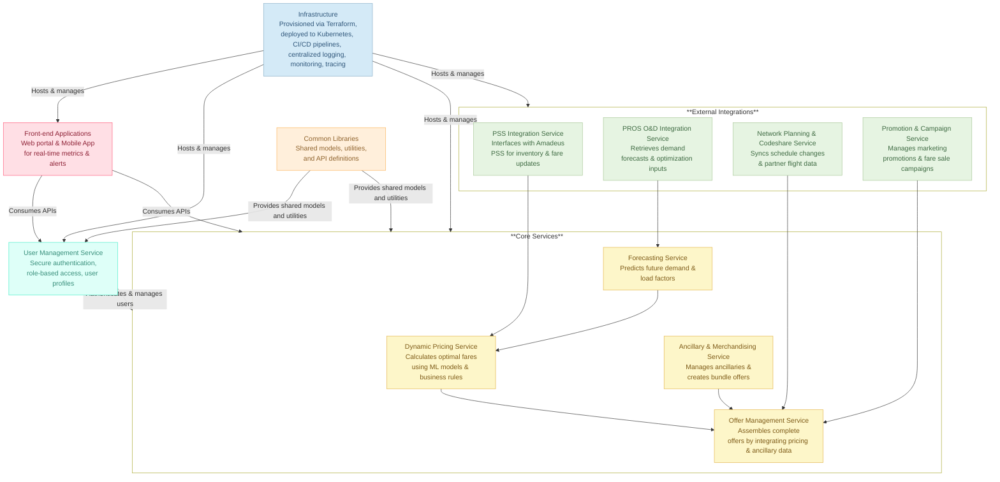

## Airline Fare Optimization Engine (AFOE)
The **Airline Fare Optimization Engine (AFOE)** is an advanced, fully automated solution designed to revolutionize airline revenue management and customer experience. Leveraging real‑time data, machine learning, and robust integrations with industry‑standard systems, AFOE dynamically adjusts fares to maximize revenue yield while ensuring transparent, fair pricing for passengers.

AFOE is built on a microservices architecture deployed on a cloud‑native platform. It seamlessly integrates with external systems—such as 
```
** Amadeus PSS, PROS O&D, pricing tools, and network planning—and supports ancillary revenue streams **
```
through intelligent bundling and dynamic offer management.

---

### Key Objectives

- **Revenue Optimization:** Increase revenue per seat mile by capturing real‑time market opportunities and optimizing fares based on dynamic demand, competitive data, and historical trends.
- **Operational Efficiency:** Automate pricing adjustments and inventory management to reduce manual interventions by over 90%, ensuring rapid responses to market changes.
- **Customer-Centricity:** Enhance passenger trust with transparent fare explanations and personalized offers tailored to individual travel profiles.
- **Scalability & Resilience:** Ensure high availability and regulatory compliance through a microservices‑based, cloud‑native deployment with robust CI/CD pipelines and comprehensive monitoring.
- **Ancillary & Bundling Optimization:** Drive additional revenue with intelligent bundling of ancillary services and dynamic promotional campaigns.'

> Refer to [Roadmap](https://github.com/suprachakra/Airline-Fare-Optimization-Engine-AFOE-/blob/main/docs/product/07_Roadmap_and_Milestones.md)
---

### Architecture Summary

AFOE is composed of several inter‑connected microservices and integration modules:
- **Core Services:**
  - **Dynamic Pricing Service:** Calculates optimal fares using advanced ML models and business rules.
  - **Forecasting Service:** Predicts future demand and load factors.
  - **Ancillary & Merchandising Service:** Manages ancillary products and dynamically creates bundle offers.
  - **Offer Management Service:** Assembles complete travel offers by integrating pricing and ancillary data.
- **External Integrations:**
  - **PSS Integration Service:** Interfaces with Amadeus PSS for inventory and fare updates.
  - **PROS O&D Integration Service:** Retrieves demand forecasts and optimization inputs.
  - **Network Planning & Codeshare Service:** Syncs schedule changes and partner flight data.
  - **Promotion & Campaign Service:** Manages marketing promotions and fare sale campaigns.
- **User Management Service:** Handles secure authentication, role‑based access, and user profiles.
- **Front-end Applications:** A web portal for internal users and a mobile app for managers to monitor real‑time metrics and alerts.
- **Common Libraries:** Shared models, utilities, and API definitions ensure consistency across the system.
- **Infrastructure:** Provisioned via Terraform and deployed to Kubernetes, with robust CI/CD pipelines (GitHub Actions, Jenkins, Azure Pipelines), centralized logging, monitoring, and distributed tracing.

For a detailed view, please refer to the documentation in the `docs/` folder.


---

### Features

- **Dynamic Fare Calculation:** Automatically adjusts fares based on live demand, inventory, and competitive benchmarks.
- **Demand Forecasting:** Uses historical data and real‑time inputs to predict booking trends.
- **Ancillary Bundling:** Combines base fares with ancillary services to create attractive bundles.
- **Personalized Offers:** Tailors travel offers based on loyalty status, travel type, and user preferences.
- **Robust Integrations:** Seamlessly connects with Amadeus PSS, PROS O&D, and other external systems.
- **Multi‑Platform Access:** Accessible via a web portal for analysts and a mobile app for on‑the‑go monitoring.
- **Automated Deployment & Monitoring:** End-to‑end CI/CD, automated tests, and real‑time observability ensure continuous, reliable delivery.

---

### Technologies & Tools

- **Backend:** Python (Flask/FastAPI), Docker, Kubernetes, Terraform
- **Frontend (Web):** React, Webpack, Babel, CSS Modules
- **Mobile:** React Native, Metro Bundler, Firebase Cloud Messaging
- **CI/CD:** GitHub Actions, Jenkins, Azure Pipelines, Docker Compose
- **Monitoring:** Prometheus, Grafana, Alertmanager, Fluentd, Jaeger
- **Database:** PostgreSQL (with migration scripts for each service)
- **API Documentation:** OpenAPI (Swagger)

---

### Installation & Setup

#### Prerequisites
- **Git** – for source code management.
- **Docker & Docker Compose** – for containerization.
- **Terraform** – for infrastructure provisioning.
- **Kubernetes CLI (kubectl)** – for managing cluster deployments.
- **Node.js & npm** – for front-end development.
- **Python 3.9+** – for backend services.

#### Local Development
1. **Clone the Repository:**
   ```bash
   git clone https://github.com/your_org/AirlineFareOptimizationEngine.git
   cd AirlineFareOptimizationEngine
   ```
2. **Set Up Environment Variables:**
   - Copy `config/dev.env.example` to `.env` and update as needed.
3. **Initialize Local Environment:**
   ```bash
   cd scripts
   ./init_local_env.sh
   ```
4. **Start All Services:**
   ```bash
   ./start_all.sh
   ```
5. **Run Tests:**
   ```bash
   ./run_tests.sh
   ```
6. **Lint and Format Code:**
   ```bash
   ./lint_and_format.sh
   ```

#### Deployment
- **Terraform & Kubernetes:**
  - Use Terraform scripts in `infrastructure/terraform/` to provision cloud resources.
  - Deploy Kubernetes manifests in `infrastructure/k8s/` using `./ci-cd/k8s-deploy.sh`.
- **CI/CD Pipelines:**
  - CI/CD workflows are available in `ci-cd/.github/workflows/`.
  - Jenkins and Azure Pipelines configurations are also provided.

For more details, please refer to the respective documentation in the `docs/` and `infrastructure/` folders.

---

### Documentation

For comprehensive documentation on architecture, product strategy, design, integration, data governance, operations, and QA, please refer to the `docs/` folder. It includes:
- **Architecture:** Detailed design, microservices interactions, integration strategies, and design decisions.
- **Product:** Vision, EPICs, OKRs, features, requirements, and roadmap.
- **Design:** User experience artifacts, wireframes, and UI guidelines.
- **Integration:** External system integrations and API definitions.
- **Data:** Data models, governance policies, and analytics.
- **Ops:** Monitoring, logging, incident response, and disaster recovery plans.
- **QA:** Test strategies, test plans, and results templates.

**Airline Fare Optimization Engine** is designed to set a new standard in airline revenue management by delivering a robust, scalable, and fully automated solution that meets the highest industry standards.

---
