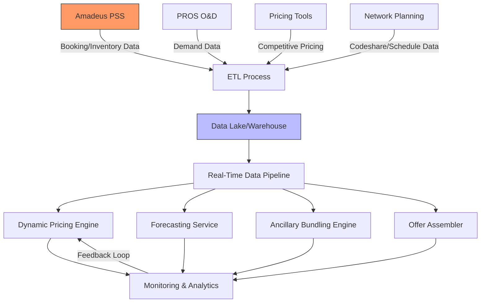

## Integration Strategy
DFAE integrates with several external systems to ingest real-time data and deliver precise dynamic pricing. This document describes the integration architecture and patterns ensuring robust, automated, and seamless connectivity with external systems.

### External Systems and Data Flows

#### Amadeus PSS Integration
- **Purpose:** Synchronize booking, inventory, and fare data.
- **Mechanism:** RESTful APIs with secure token-based authentication.
- **Data:** Real-time inventory, booking transactions, fare updates.
- **Error Handling:** Automated retries, circuit breakers, fallback caching.

#### PROS O&D Integration
- **Purpose:** Retrieve demand and route performance data.
- **Mechanism:** RESTful API and batch file ingestion.
- **Data:** Historical and real-time demand metrics, load factors.
- **Error Handling:** Data validations and fallback to historical averages.

#### Pricing Tools Integration
- **Purpose:** Obtain competitive pricing data.
- **Mechanism:** Real-time API calls and periodic synchronization.
- **Data:** Competitor fare benchmarks and elasticity data.
- **Error Handling:** Standardized error handling, with retries and fallback defaults.

#### Network Planning & Codeshare Integration
- **Purpose:** Ingest schedule updates and partner codeshare data.
- **Mechanism:** API calls and batch processing.
- **Data:** Flight schedules, codeshare agreements, partner connectivity.
- **Error Handling:** Real-time validations, fallback to static schedules if needed.

### Internal Communication
- **Synchronous Communication:** Direct REST/gRPC calls for immediate transactions.
- **Asynchronous Messaging:** Use of an event bus (Kafka) for decoupled data updates and inter-service communication.

### Data Synchronization and Security
- All integrations use encrypted channels (TLS 1.2+).
- API adapters ensure data normalization and transformation.
- Automated error handling and logging capture any integration failures for immediate resolution.

