## Microservices Detailed Overview
This document details each microservice within DFAE, describing its role, internal components, and interactions with other services. The design ensures modularity, resilience, and full automation.

### Microservices Breakdown

#### Pricing Service
- **Role:** Calculate dynamic fares using real-time data.
- **Components:**
  - **DynamicPricingEngine:** Uses ML models and historical data to compute optimal fares.
  - **RulesEngine:** Enforces business rules (e.g., minimum/maximum fare limits, competitive matching).
  - **PricingController:** Exposes APIs for fare requests.
- **Interactions:** Communicates with Forecasting Service for demand data; integrates with external Pricing Tools.

#### Forecasting Service
- **Role:** Predict future demand and load factors.
- **Components:**
  - **ForecastModel:** Implements statistical and ML-based forecasting.
  - **ModelTrainer:** Batch training/updating of forecast models.
  - **ForecastController:** Provides APIs to fetch forecasts and trigger retraining.
- **Interactions:** Feeds data into the Pricing Service; may use data from PROS O&D.

#### Ancillary Service
- **Role:** Manage and personalize ancillary product bundling.
- **Components:**
  - **BundlingEngine:** Dynamically creates bundles (e.g., extra baggage, seat upgrades).
  - **Personalization Module:** Customizes offers based on user profiles.
  - **AncillaryController:** APIs for retrieving ancillary options.
- **Interactions:** Integrates with Pricing and Offer Management Services.

#### Offer Management Service
- **Role:** Assemble complete travel offers by combining base fares with ancillary options.
- **Components:**
  - **OfferAssembler:** Merges fare data and ancillary bundles.
  - **PersonalizationEngine:** Adjusts offers based on user data.
  - **OfferController:** Exposes APIs to retrieve personalized offers.
- **Interactions:** Receives data from Pricing, Ancillary, and Forecasting Services.

#### Integration Services
- **Role:** Connect DFAE with external systems (Amadeus PSS, PROS O&D, Pricing Tools, Network Planning).
- **Components:**
  - **API Adapters:** Convert external data to internal formats.
  - **Data Validators:** Ensure data quality and consistency.
  - **Error Handlers:** Automate retries and fallbacks.
- **Interactions:** Feed data into core services; use asynchronous messaging where needed.

### Communication Patterns
- **Synchronous:** REST/gRPC calls for immediate data exchange.
- **Asynchronous:** Event-driven messaging (Kafka/RabbitMQ) for background processing and updates.

### Monitoring & Health
Each microservice exposes health and metrics endpoints for continuous automated monitoring and immediate issue resolution.

*Note:* All microservices have been designed with extensive automated testing, CI/CD integration, and are containerized for deployment in Kubernetes.

```mermaid
%% Detailed Microservices Interaction Diagram for DFAE
graph TD

    %% ------------------------
    %% External Systems
    %% ------------------------
    subgraph External_Systems [External Systems]
      A1[Amadeus PSS<br/>Booking, Inventory, Fare Data]
      A2[PROS O&D<br/>Demand & Route Analytics]
      A3[Pricing Tools<br/>Competitor Pricing]
      A4[Network Planning / Codeshare<br/>Schedules, Partner Data]
      A5[Promotion Providers<br/>Campaign Data]
      A6[Regulatory Updates<br/>Compliance Data]
    end

    %% ------------------------
    %% Integration Services
    %% ------------------------
    subgraph Integrations [Integration Services]
      B1[PSS Integration Service<br/>Adapter, Retry Logic]
      B2[PROS Integration Service<br/>Data Normalizer]
      B3[Pricing Tools Integration<br/>Adapter, Validator]
      B4[Network Planning Integration<br/>Importer, Sync]
      B5[Promotion Service<br/>Campaign Engine]
      B6[User Management Service<br/>Auth, Profile Data]
      B7[Compliance Service<br/>Audit, Anonymization]
    end

    %% ------------------------
    %% API Gateway
    %% ------------------------
    subgraph Gateway [API Gateway]
      C[API Gateway<br/>Authentication, Rate Limiting, Routing]
    end

    %% ------------------------
    %% Core Microservices
    %% ------------------------
    subgraph Core [Core Microservices]
      D[Pricing Service<br/>Dynamic Pricing Engine, Rules Engine, PricingController]
      E[Forecasting Service<br/>Forecast Model, Model Trainer, ForecastController]
      F[Ancillary Service<br/>Bundling Engine, Personalization Module, AncillaryController]
      G[Offer Management Service<br/>Offer Assembler, Personalization Engine, OfferController]
    end

    %% ------------------------
    %% Shared Infrastructure
    %% ------------------------
    subgraph Shared [Shared Infrastructure]
      H[Data Layer<br/>Data Lake / Warehouse]
      I[Configuration Management<br/>Dynamic Config, Feature Toggles]
      J[Monitoring & Logging<br/>Prometheus, Grafana, Fluentd]
      K[CI/CD Pipeline<br/>GitHub Actions, Jenkins, Helm]
      L[Security & Compliance<br/>Encryption, Vulnerability Scans]
    end

    %% ------------------------
    %% Connections: External Systems → Integration Services
    %% ------------------------
    A1 -->|Sends booking/inventory data| B1
    A2 -->|Sends demand & route data| B2
    A3 -->|Sends competitor pricing data| B3
    A4 -->|Sends schedule & codeshare data| B4
    A5 -->|Sends promotional campaign data| B5
    A6 -->|Sends regulatory updates| B7

    %% ------------------------
    %% Connections: Integration Services → Core Microservices
    %% ------------------------
    B1 -->|Normalized PSS data| D
    B2 -->|Demand forecasts| E
    B3 -->|Competitive pricing benchmarks| D
    B4 -->|Codeshare and schedule updates| G
    B5 -->|Promotional rules and campaigns| G
    B6 -->|User authentication & profile data| D & E & F & G
    B7 -->|Compliance data & audit logs| I & L

    %% ------------------------
    %% Connections: API Gateway → Core Microservices
    %% ------------------------
    C -->|Routes API calls| D
    C -->|Routes API calls| E
    C -->|Routes API calls| F
    C -->|Routes API calls| G

    %% ------------------------
    %% Core Microservices Internal Interactions
    %% ------------------------
    D -->|Sends dynamic fare data| G
    E -->|Provides demand insights| D
    F -->|Sends ancillary bundle details| G

    %% ------------------------
    %% Shared Infrastructure Interactions
    %% ------------------------
    H -->|Stores and serves data| D
    H -->|Stores and serves data| E
    H -->|Stores and serves data| F
    H -->|Stores and serves data| G
    I -->|Provides dynamic configuration| B1
    I -->|Provides dynamic configuration| B2
    I -->|Provides dynamic configuration| B3
    I -->|Provides dynamic configuration| B4
    I -->|Provides dynamic configuration| B5
    I -->|Provides dynamic configuration| D
    I -->|Provides dynamic configuration| E
    I -->|Provides dynamic configuration| F
    I -->|Provides dynamic configuration| G
    J -->|Monitors and logs events| C
    J -->|Monitors and logs events| D
    J -->|Monitors and logs events| E
    J -->|Monitors and logs events| F
    J -->|Monitors and logs events| G
    J -->|Monitors and logs events| B1
    J -->|Monitors and logs events| B2
    J -->|Monitors and logs events| B3
    J -->|Monitors and logs events| B4
    J -->|Monitors and logs events| B5
    J -->|Monitors and logs events| B6
    J -->|Monitors and logs events| B7
    K -->|Automates builds, tests, and deployments| C
    K -->|Automates builds, tests, and deployments| D
    K -->|Automates builds, tests, and deployments| E
    K -->|Automates builds, tests, and deployments| F
    K -->|Automates builds, tests, and deployments| G
    K -->|Automates builds, tests, and deployments| B1
    K -->|Automates builds, tests, and deployments| B2
    K -->|Automates builds, tests, and deployments| B3
    K -->|Automates builds, tests, and deployments| B4
    K -->|Automates builds, tests, and deployments| B5
    K -->|Automates builds, tests, and deployments| B6
    K -->|Automates builds, tests, and deployments| B7

L -->|Secures data and conducts vulnerability scans| H
L -->|Secures data and conducts vulnerability scans| I
L -->|Secures data and conducts vulnerability scans| J
L -->|Secures data and conducts vulnerability scans| D
L -->|Secures data and conducts vulnerability scans| E
L -->|Secures data and conducts vulnerability scans| F
L -->|Secures data and conducts vulnerability scans| G





    %% ------------------------
    %% Feedback Loops and Dynamic Adaptation
    %% ------------------------
    J -->|Triggers alerts for performance, drift, or errors| D
    J -->|Alerts security/compliance issues| L
    I -->|Pushes configuration updates in real time| D
    I -->|Pushes configuration updates in real time| E
        I -->|Pushes configuration updates in real time| F
            I -->|Pushes configuration updates in real time| G
```

