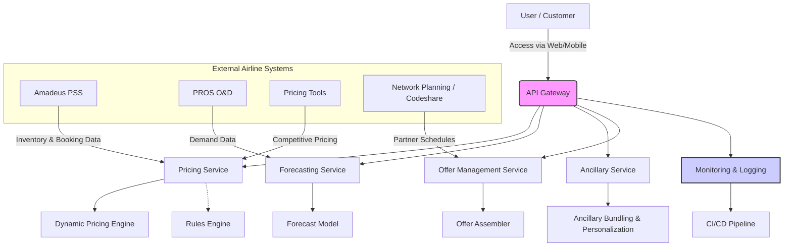
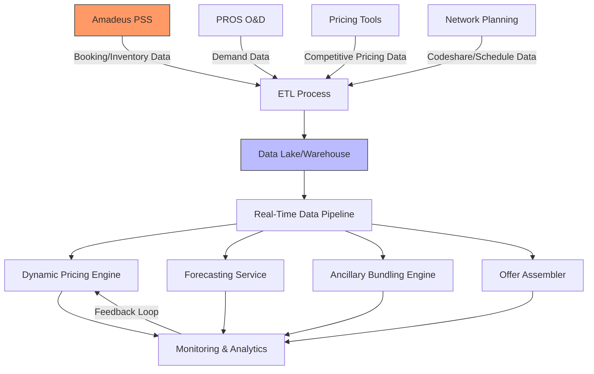

## System Design Overview

### Introduction
The Dynamic Fare Adjustment Engine (DFAE) is built on a cloud-native, microservices-based architecture designed to dynamically adjust airline fares in real time. Our system is engineered for scalability, resilience, and full integration with critical external airline systems.

### Architectural Vision
- **Scalability:** Cloud-native microservices with auto-scaling and distributed data processing.
- **Resilience:** Automated failover, continuous monitoring, and self-healing mechanisms ensure 99.9% uptime.
- **Integration:** Seamless connections to external systems (Amadeus PSS, PROS O&D, Pricing Tools, Ancillary, and Network Planning) using REST/gRPC APIs and event-driven messaging.
- **Compliance & Security:** Data encryption, automated audit trails, and continuous compliance checks ensure adherence to global regulations.
- **User-Centric:** Transparent, real-time fare adjustments with clear explanations provided to customers.

### High-Level System Components
- **API Gateway:** Routes incoming requests to appropriate services with authentication, rate limiting, and logging.
- **Core Microservices:**  
  - **Pricing Service:** Computes dynamic fares using ML models and business rules.  
  - **Forecasting Service:** Provides demand forecasts to inform pricing.  
  - **Ancillary Service:** Bundles and personalizes ancillary offerings.  
  - **Offer Management Service:** Combines fares and ancillaries into complete travel offers.
- **External Integration Services:**  
  - Integration modules for Amadeus PSS, PROS O&D, Pricing Tools, and Network Planning.
- **Data Layer:** Hybrid storage (NoSQL for real-time data, relational DBs for historical and transactional data).
- **Monitoring & Logging:** Centralized monitoring using Prometheus, Grafana, and Fluentd; automated alerting via Alertmanager.
- **CI/CD Pipeline:** Automated builds, tests, security scans, and deployments using GitHub Actions (or similar tools).

### System Architecture Diagram

### Data Flow Diagram

