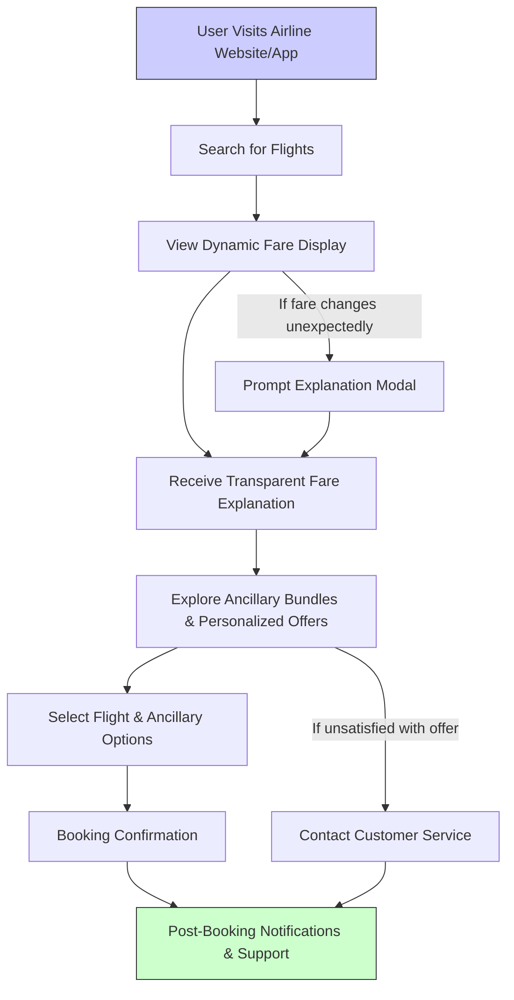

## Market and User Insights

### Market Research Overview
The airline industry is transforming rapidly due to digital innovation, intense competition, and evolving customer expectations. Key findings include:
- **Dynamic Pricing Potential:** Dynamic pricing models can deliver a 3–10% revenue uplift per seat mile by leveraging real-time market data.
- **Ancillary Revenue Opportunity:** Intelligent bundling of ancillaries (e.g., baggage, seat upgrades, in-flight services) can boost non-ticket revenue by 10–15%.
- **Customer Expectations:** Modern travelers demand transparency, personalized offers, and immediate responses.
- **Competitive Landscape:** Legacy pricing systems are unable to respond in real time, leaving significant market gaps for advanced, automated pricing solutions.

### User Insights and Personas
Extensive qualitative and quantitative research (surveys, interviews, focus groups) has identified a diverse set of personas that will benefit from DFAE. These insights inform both our product design and operational strategy.

#### Detailed User Personas

| User Persona               | Needs                                                    | Challenges                                                   | Impact                                                    |
|----------------------------|----------------------------------------------------------|--------------------------------------------------------------|-----------------------------------------------------------|
| **Pricing Analyst**        | Real-time data and advanced analytics                    | Inconsistent data; manual processing is time-consuming         | Better decision-making; higher revenue yield               |
| **Revenue Manager**        | Predictive insights and consistent, transparent pricing   | Balancing yield optimization with customer satisfaction         | Increased yield; efficient revenue management              |
| **Frequent Traveler**      | Stable, fair pricing with loyalty incentives              | Unpredictable fare fluctuations; confusing pricing models       | Enhanced loyalty and trust; increased repeat bookings        |
| **Business Traveler**      | Priority access and reliability; minimal pricing surprises  | Last-minute bookings; high price volatility                     | Improved corporate travel experience; higher conversion rates |
| **Corporate Travel Manager** | Consistent pricing for negotiated contracts; clarity between public and private fares | Protecting contracted rates amidst dynamic public pricing       | Better budgeting and cost predictability; stronger client relations |
| **Leisure Traveler**       | Simple and transparent pricing; appealing promotions        | Overwhelming fare choices; fear of being overcharged              | Higher conversion rates; improved overall travel experience   |
| **Customer Service Agent** | Clear, consistent fare explanations; rapid resolution tools | High volume of price inquiries; inconsistent internal messaging   | Reduced call volume; faster query resolution                |
| **IT/Operations Manager**  | Robust, scalable systems with automated monitoring         | Complex integrations; ensuring continuous uptime and performance | Smoother operations; reduced downtime and maintenance costs   |

### Competitive Analysis
- **Current Landscape:** Many airlines still rely on static pricing models or partially automated systems that lack real-time responsiveness.
- **Market Gaps:** Existing solutions do not fully integrate modern data sources or provide transparent pricing explanations and personalized ancillary bundles.
- **DFAE Advantage:** Our engine offers fully automated, real-time dynamic pricing with comprehensive integration, advanced analytics, and complete transparency.
- **Revenue Models and Expansion Plans:**  
  - **Primary Revenue:** Increased yield per seat mile.  
  - **Ancillary Revenue:** Enhanced through dynamic bundling and personalized upsells.  
  - **Market Expansion:** Potential to extend into loyalty-driven pricing and dynamic corporate travel deals.

*Note:* These insights and personas drive our product design and operational priorities, ensuring that every stakeholder’s unique needs are met in a data-informed, fully automated manner.

### User Journey Flowchart

